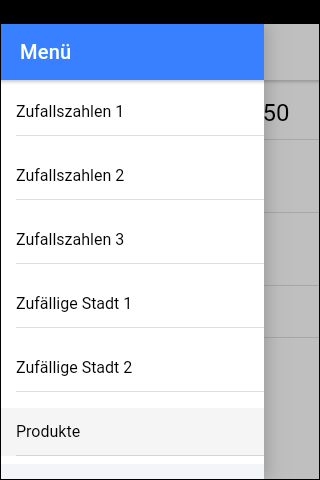
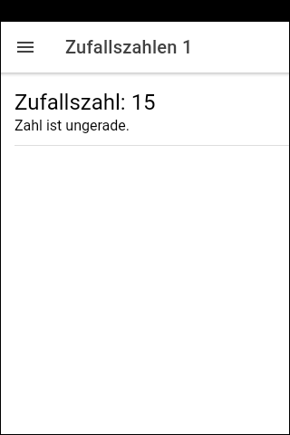
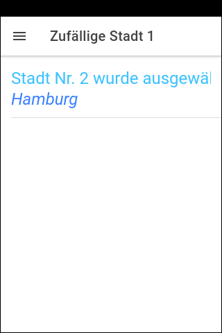
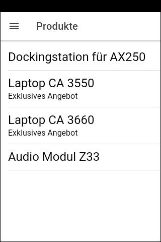

# Ionic-App "Wenn-Dann" #

Simple [Ionic](https://ionicframework.com) app to demonstrate usage of structural directives `*ngIf` and `ngSwitch`.

 

----
## Screenshots ##

   

   

 

----
## Run the app locally ##

Prerequisite: NPM package [`@ionic/cli`](https://www.npmjs.com/package/@ionic/cli) must be installed globally.

 

**Steps:**

1. Clone the repository.

2. Open shell in root folder of cloned repository and execute `npm install`.

3. To run app locall in browser execute `ionic serve`.

 

----
## License ##

See the [LICENSE file](LICENSE.md) for license rights and limitations (BSD 3-Clause License) for the files in this repository.
